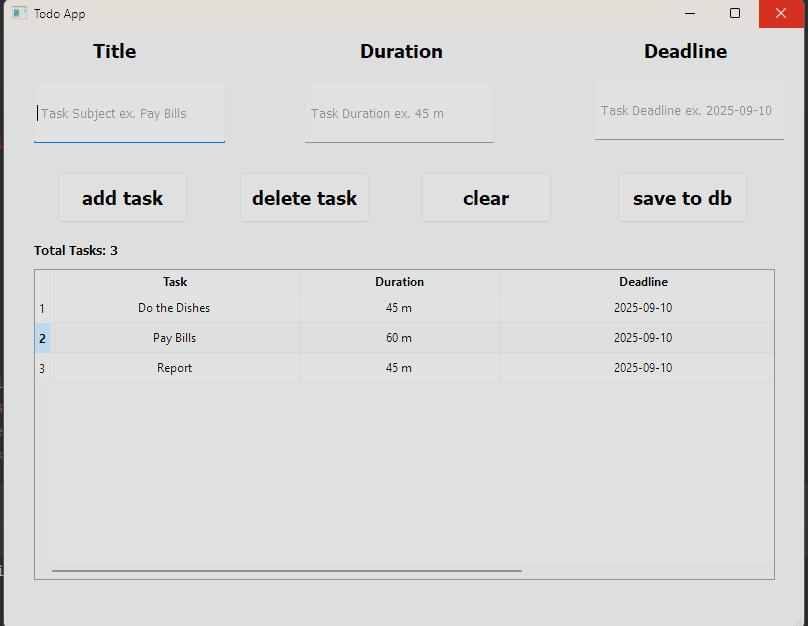

# 📝 To-Do Manager

A simple desktop **To-Do List application** built with **PyQt5** and **MySQL**, developed by **Alireza Ardani (Python Developer)**.  
This app provides a lightweight yet practical way to manage daily tasks with features like adding, deleting, clearing, and saving tasks to a database.  

---

## ✨ Features

- ✅ **Add Tasks**: Create new tasks with a **subject**, **duration**, and **deadline**.  
- ✅ **Delete Tasks**: Remove a selected task after confirmation.  
- ✅ **Clear All Tasks**: Quickly clear all tasks (with warning if table is empty).  
- ✅ **Auto Task Counter**: Displays the total number of tasks currently loaded.  
- ✅ **Database Integration**:  
  - Loads saved tasks from **MySQL database** at startup.  
  - Saves all current tasks back to the database when you hit the **Save** button.  
- ✅ **Clean UI**: Modern and user-friendly PyQt5 interface.  
- ✅ **Table Management**: Tasks are shown in a `QTableWidget` with centered columns.  

---

## 🖥️ User Interface

### Below is a preview of the application’s UI:




---

## ⚙️ Installation & Setup

### Requirements
- Python 3.x  
- [PyQt5](https://pypi.org/project/PyQt5/)  
- [mysql-connector-python](https://pypi.org/project/mysql-connector-python/)  
- MySQL Server  or Docker Desktop ( use mysql image )

Install dependencies:
```bash
pip install -r requirements.txt
